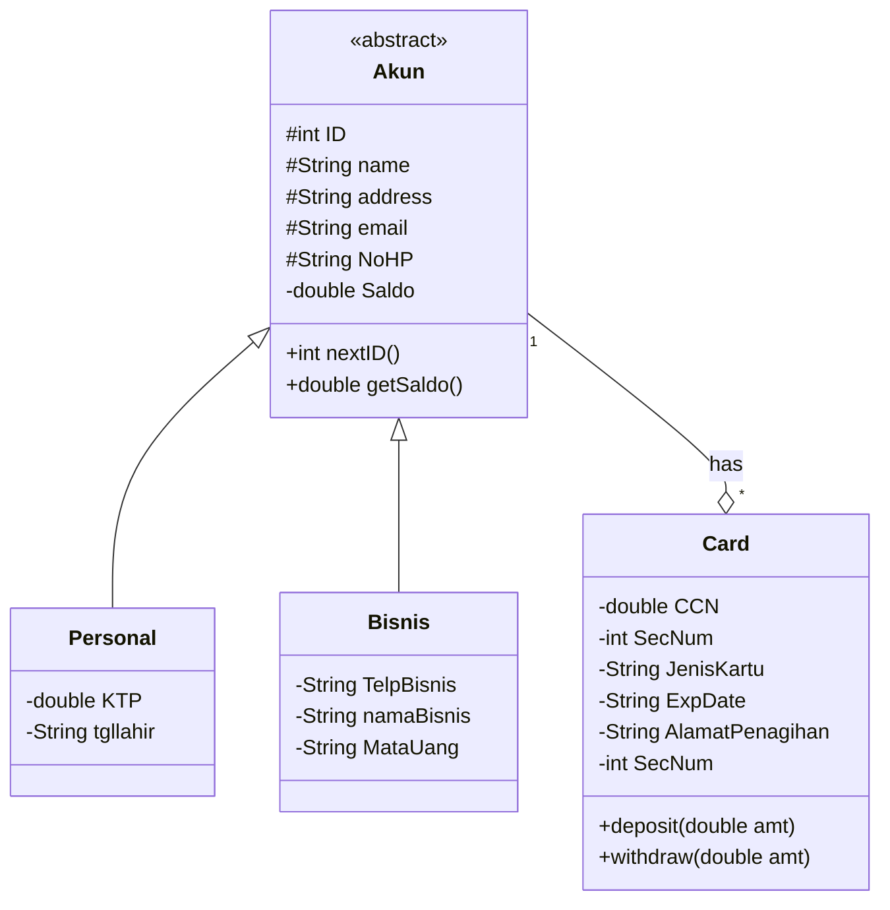

# Payapay-Projek-PBO

# Pay Pay System
>Sistem PayPay
 adalah sistem yang digunakan untuk melakukan transaksi pembayaran. terdapat dua jenis akun yaitu personal dan bisnis. satu akun dapat memiliki satu atau lebih kartu.

## Desain
>Untuk melihat diagram, install plugin mermaid-diagram di https://github.com/Redisrupt/mermaid-diagrams
### Class Diagram

erDiagram
        AKUN ||..|| PERSONAL : is 
        AKUN ||--|| BISNIS : is 
        AKUN ||--|{CARD : "has"
        AKUN{
            int id
            string name
            string address
            string email
            string NoHP
            double Saldo
        }
        PERSONAL{
            double KTP
            string tgllahir
        }
        BISNIS{
            string TelpBisnis
            string namaBisnis
            string mataUang
        }
        CARD{
            double CCN
            string JenisKartu
            string ExpDate
            string alamatpenagihan
            int SecNum
        }
